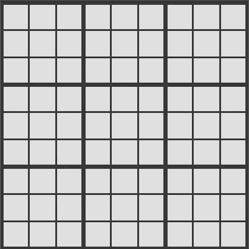
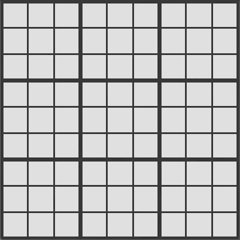

# godoku
Sudoku solver made as an exercise to learn Go

## Examples:
1. "**go run screen.go hard**"
  -fetches a hard board from sudoku.com and starts the GUI (can choose one of: easy/medium/hard/expert)
 2. "**go run screen.go myboard.txt**"
  -Fetches a board stored in presets/myboard.txt and starts the GUI

### Solving a *hard* board without a single guess

### Solving an *Expert* boards is a bit more involved requiring some guessing and backtracking

## Using the GUI
1. Left click to make one move
2. Right arrow to speed through moves

## Extra info
A number highlighted red indicates that the algorihm had to make an educated guess(prioritising guesses with higher probability of success). If the guess leads to an impossible board state the algorithm will backtrack and try a new number.

